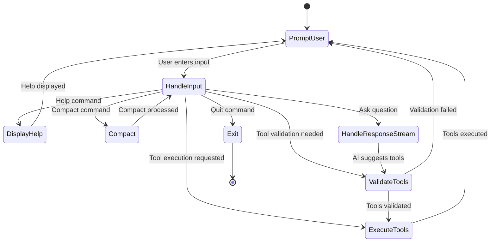
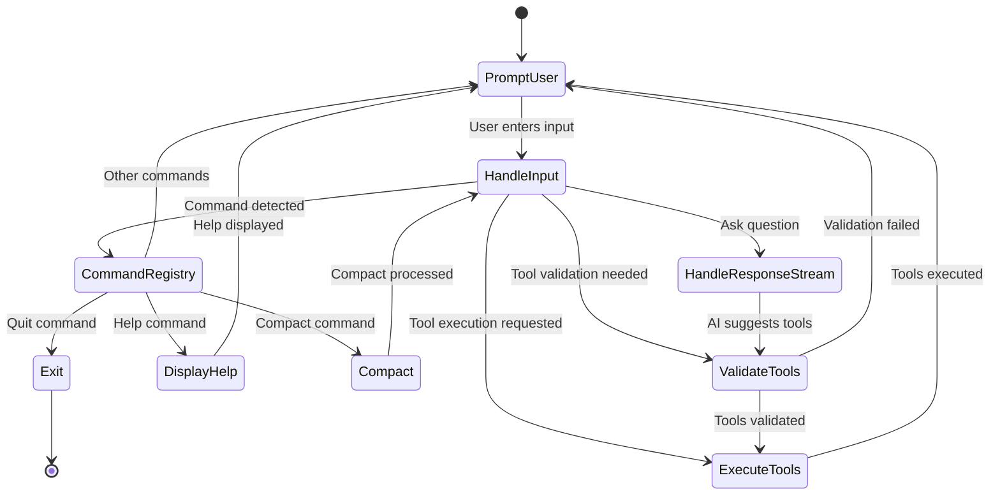
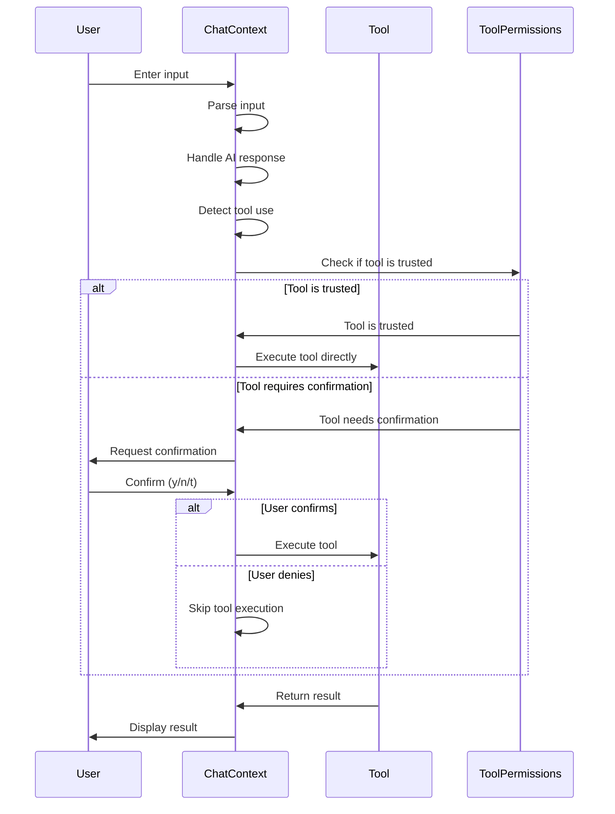
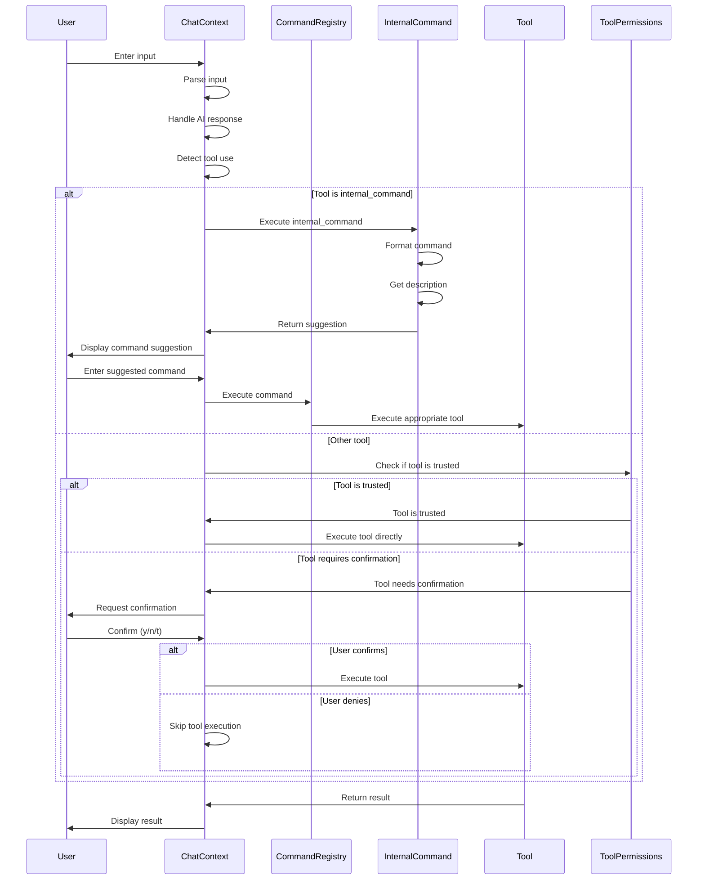
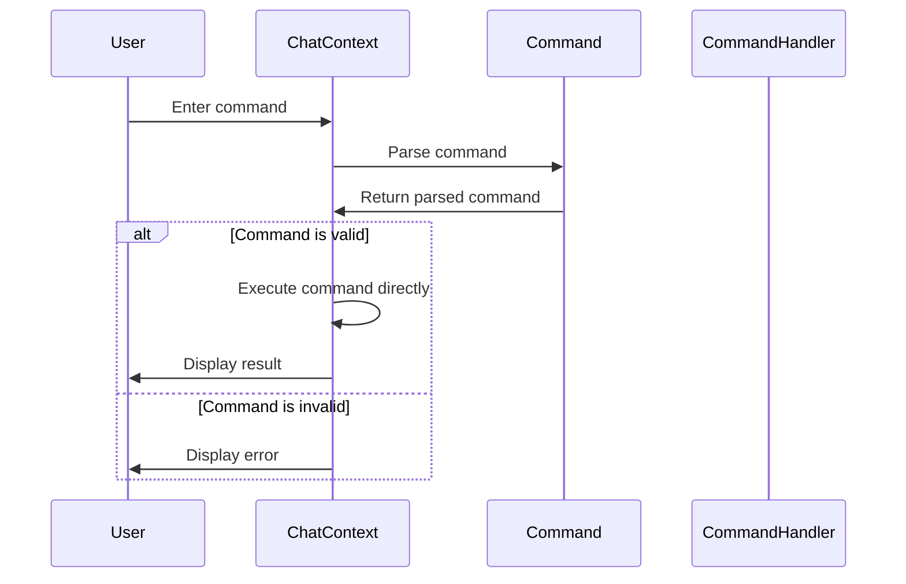
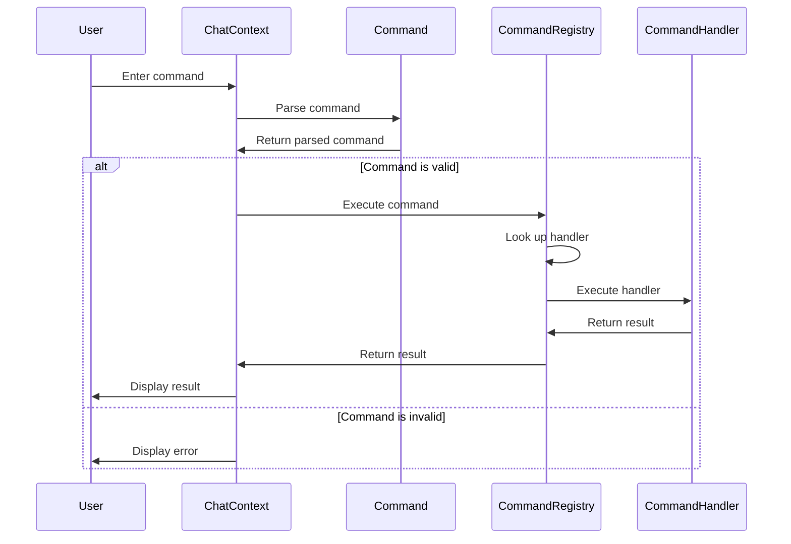
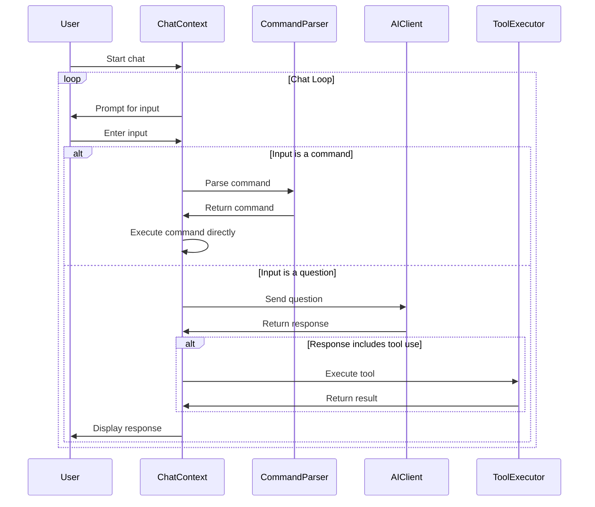
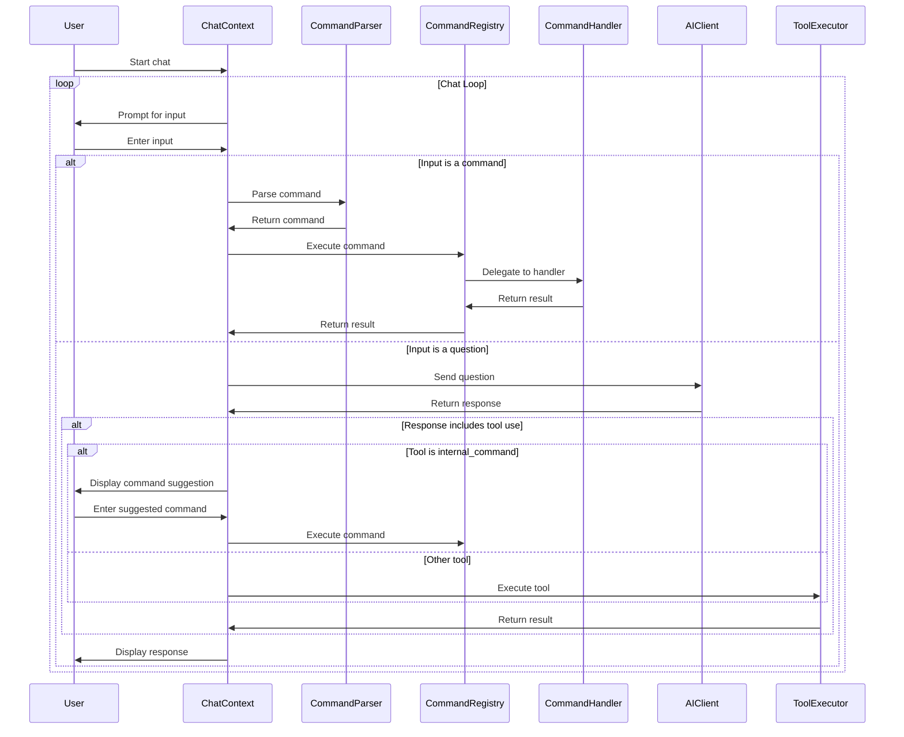

# Command Registry Architecture Comparison

This document compares the architecture before and after implementing the Command Registry system as outlined in RFC 0002. It includes state transition diagrams, sequence diagrams, and detailed comparisons for each component.

## Table of Contents

1. [State Transition Diagrams](#state-transition-diagrams)
2. [Tool Execution Flow](#tool-execution-flow)
3. [Command Execution Flow](#command-execution-flow)
4. [Chat Loop Flow](#chat-loop-flow)
5. [Summary of Changes](#summary-of-changes)

## State Transition Diagrams

### Before: Chat State Transitions

### After: Chat State Transitions with Command Registry

### Comparison: State Transitions

The key difference in the state transition diagrams is the introduction of the CommandRegistry state. In the original architecture, commands were handled directly within the HandleInput state. The new architecture introduces a dedicated CommandRegistry state that processes all commands through a unified interface.

This change provides several benefits:
- Better separation of concerns
- More consistent command handling
- Easier addition of new commands
- Improved testability of command execution

The overall flow remains similar, but the command handling is now more structured and modular.

## Tool Execution Flow

### Before: Tool Execution Sequence

### After: Tool Execution Sequence with internal_command

### Comparison: Tool Execution

The key differences in the tool execution flow are:

1. **Introduction of the InternalCommand Tool**:
   - The new architecture introduces a dedicated InternalCommand tool that handles command suggestions
   - Instead of executing commands directly, it formats and suggests commands to the user

2. **Command Registry Integration**:
   - When the user enters a suggested command, it's processed through the CommandRegistry
   - The CommandRegistry delegates to the appropriate command handler

3. **Two-Step Command Execution**:
   - In the new architecture, command execution becomes a two-step process:
     1. AI suggests a command via the InternalCommand tool
     2. User enters the suggested command, which is then executed

This approach provides several benefits:
- Better user control over command execution
- Clearer separation between AI suggestions and actual command execution
- More consistent handling of commands
- Improved security by requiring explicit user action for command execution

## Command Execution Flow

### Before: Command Execution Sequence

### After: Command Execution Sequence with Registry

### Comparison: Command Execution

The key differences in the command execution flow are:

1. **Introduction of the CommandRegistry**:
   - The new architecture introduces a dedicated CommandRegistry that manages command handlers
   - Commands are no longer executed directly by the ChatContext

2. **Command Handler Delegation**:
   - The CommandRegistry delegates command execution to specific CommandHandler implementations
   - Each command has its own handler class that implements the CommandHandler trait

3. **Standardized Interface**:
   - All commands now follow a standardized interface defined by the CommandHandler trait
   - This ensures consistent behavior across all commands

This approach provides several benefits:
- Better separation of concerns
- More modular and maintainable code
- Easier addition of new commands
- Improved testability of command execution
- Consistent command behavior

## Chat Loop Flow

### Before: Chat Loop Sequence

### After: Chat Loop Sequence with Command Registry

### Comparison: Chat Loop

The key differences in the chat loop flow are:

1. **Command Registry Integration**:
   - Commands are now processed through the CommandRegistry instead of being executed directly
   - The CommandRegistry delegates to specific CommandHandler implementations

2. **Internal Command Tool**:
   - The chat loop now handles the internal_command tool specially
   - When the AI suggests a command, it's displayed to the user for manual execution

3. **Two-Step Command Execution**:
   - Command execution becomes a two-step process:
     1. AI suggests a command via the internal_command tool
     2. User enters the suggested command, which is then executed through the CommandRegistry

This approach provides several benefits:
- Better separation of concerns
- More consistent command handling
- Improved user control over command execution
- Enhanced security by requiring explicit user action for command execution

## Summary of Changes

The implementation of the Command Registry architecture as outlined in RFC 0002 introduces several key improvements:

1. **Better Separation of Concerns**:
   - Commands are now handled by dedicated CommandHandler implementations
   - The CommandRegistry manages command registration and execution
   - The ChatContext focuses on managing the chat flow rather than command execution

2. **More Modular and Maintainable Code**:
   - Each command has its own handler class
   - Adding new commands is as simple as implementing the CommandHandler trait
   - Command behavior is more consistent and predictable

3. **Enhanced Security**:
   - The internal_command tool suggests commands rather than executing them directly
   - Users have explicit control over command execution
   - Command permissions are managed more consistently

4. **Improved User Experience**:
   - Command suggestions provide better guidance to users
   - Command behavior is more consistent
   - Error handling is more robust

5. **Better Testability**:
   - Command handlers can be tested in isolation
   - The CommandRegistry can be tested with mock handlers
   - The chat loop can be tested with a mock CommandRegistry

These changes align with the goals of RFC 0002 to improve the command handling architecture while maintaining compatibility with the existing codebase. The suggestion-based approach allows for a smoother transition to the new command registry system.
