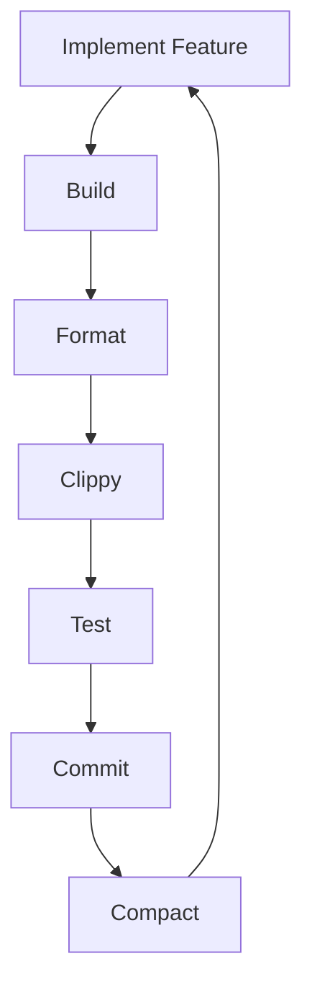

# Implementation Cycle

This document outlines the standard implementation cycle for making changes to the Amazon Q CLI codebase, particularly for the `internal_command` tool and command registry migration (note - previously called `use_q_command` - we should update any references we find).

## Standard Implementation Cycle

For each feature or command migration, follow this cycle:



### 1. Implement Feature

- Make incremental changes to the codebase
- Focus on one logical unit of functionality at a time
- Follow the design patterns established in the codebase
- Add appropriate documentation and comments

### 2. Build

```bash
cargo build -p q_cli
```

- Fix any compilation errors
- For faster builds, target only the crate you're modifying

### 3. Format

```bash
cargo +nightly fmt
```

- Ensure code follows the project's formatting standards
- This step is non-negotiable and must be done before committing

### 4. Clippy

```bash
cargo clippy -p q_cli
```

- Address all clippy warnings
- Follow Rust best practices
- For specific issues, use the `--fix` option when appropriate

### 5. Test

```bash
cargo test -p q_cli
```

- Run the test suite to ensure your changes don't break existing functionality
- Add new tests for the functionality you've implemented
- For command migrations, test both direct and tool-based execution paths

### 6. Commit

```bash
git add .
git commit -m "type(scope): description"
```

- Follow the [Conventional Commits](https://www.conventionalcommits.org/) specification
- Include the scope of the change (e.g., `command-registry`, `use-q-command`)
- Provide a clear, concise description of the change
- For larger changes, include a detailed commit message body

Example commit message:
```
feat(command-registry): Implement help command handler

Move HELP_TEXT constant to commands/help.rs and update HelpCommand::execute
to use this text. Modify Command::Help handler to delegate to CommandRegistry.

🤖 Assisted by [Amazon Q Developer](https://aws.amazon.com/q/developer)
```

### 7. Compact

After each commit, run the `/compact` command in the Amazon Q chat interface to maintain a clean conversation history. This helps keep the context focused and relevant.

## Command Migration Specific Cycle

For command migrations, follow these additional steps:

1. **Document current behavior**
   - Capture the existing implementation
   - Note any special cases or edge conditions

2. **Create test cases**
   - Define test cases that verify current behavior
   - Include basic usage, arguments, error handling, and edge cases

3. **Implement command handler**
   - Create or update the handler in the `commands/` directory
   - Ensure it implements the `CommandHandler` trait correctly

4. **Update execution flow**
   - Modify the command execution to use the CommandRegistry
   - Ensure proper argument parsing and validation

5. **Test thoroughly**
   - Test direct command execution
   - Test tool-based command execution
   - Verify identical behavior between both paths

6. **Document the migration**
   - Create a migration document using the template
   - Update the tracking document with the migration status

## Best Practices

- **Make small, focused changes**: Easier to review, test, and debug
- **Commit early and often**: Don't wait until you have a large set of changes
- **Run tests frequently**: Catch issues early
- **Update documentation as you go**: Keep documentation in sync with code
- **Follow the established patterns**: Maintain consistency across the codebase
- **Use descriptive commit messages**: Help others understand your changes
- **Run `/compact` after each commit**: Keep the conversation history clean